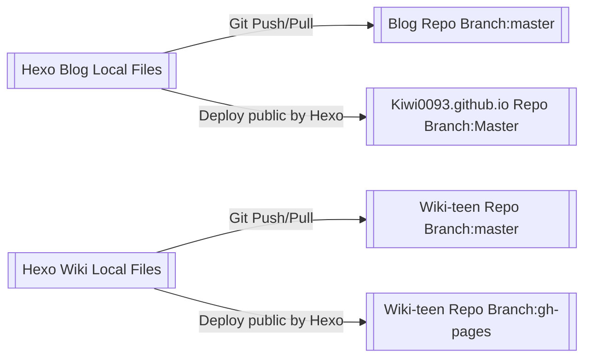

## Hexo是什麼

## 目標

利用[Hexo](https://hexo.io/zh-tw/) + [Github Page](https://pages.github.com/)實現個人Blog + Wiki的搭建

## 基本架構

### 說明

這裡利用了Github Page的幾個特性

- 在<Username>.github.io這個repo的master內的index.html會產生https://<Username>.github.io/這個有效網址
- 在其他repo中,Github Page會把branch:gh-pages內的index.thml產生出https://<username>.github.io/<其他repo>/這個有效網址

所以可以將Blog的網頁產生到<username>.github.io這個repo的master裡面作為主網頁,將其他想要的theme的網頁產生到其他repo的gh-pages內作為其他子網站使用

雖然可以利用Hexo指令可以跑特定`_config.yml`的方法可以把兩個放在一起,但是其實原理上跟上表是一樣的只是可以把Hexo Wiki 跟Hexo Blog存在同一個目錄裡面將git同步管理這點整合